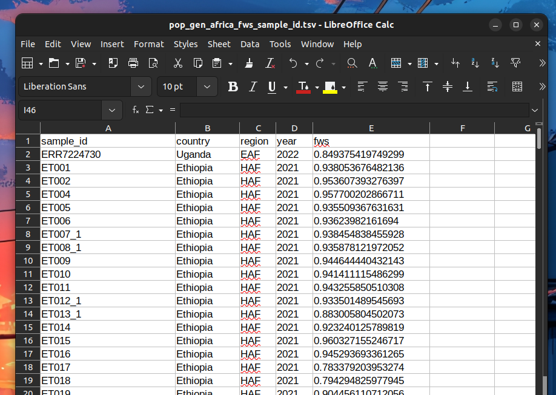
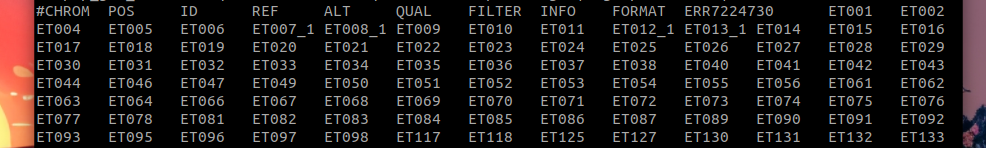
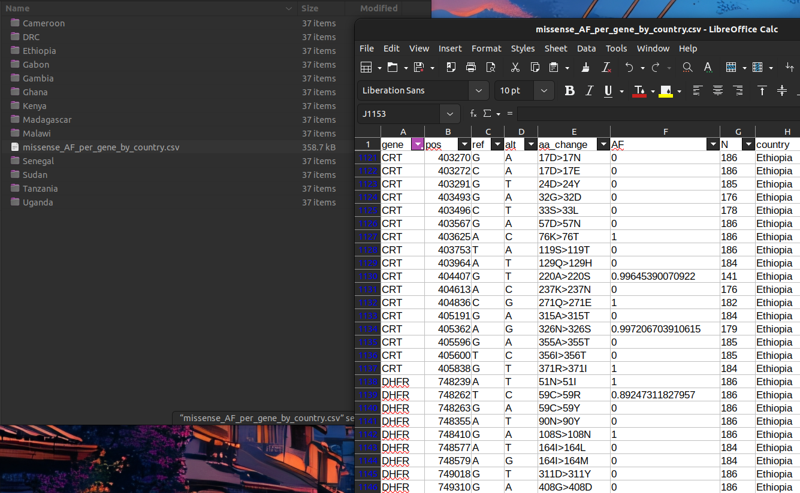
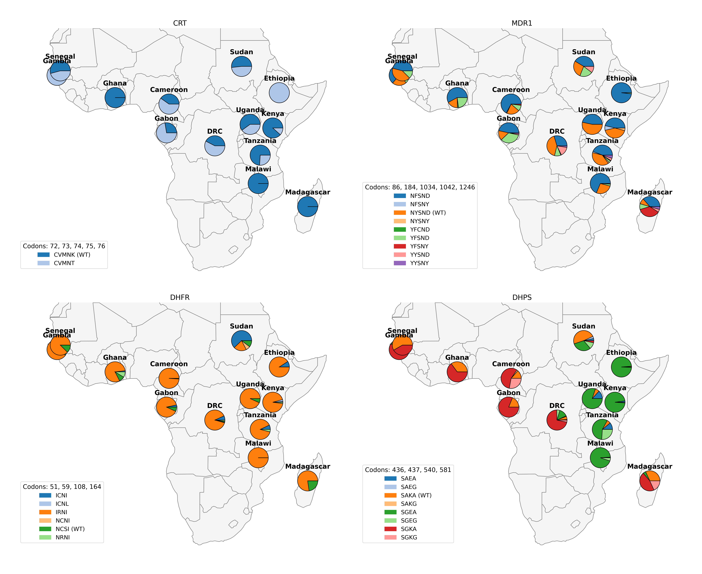
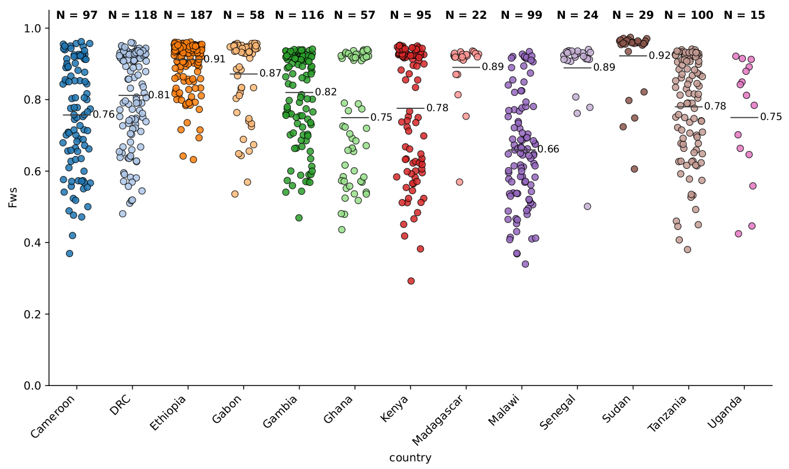

# malaria-popgen-toolkit
A collection of reproducible population genomics workflows for *Plasmodium* species, designed to support transparent, accessible, and scalable malaria genomic analysis.

*Tools and documentation were made for WGS data. Amplicon sequencing is technically not supported at the moment but many of these tools should be compatible with it.*

## Installation and Prerequisites
This toolkit has been formatted to interpret and analyse whole genome sequencing (WGS) data that has been processed using an open access *ngs-pipeline* toolkit designed by **VivaxGEN**, available at: 

https://github.com/vivaxgen/ngs-pipeline

Courtesy of Hidayat Trimarsanto (Anto) and Ludwig Kian Soon Hoon.

Downstream processing can also be carried out using the *fastq2matrix* and *malaria-hub* pipeline, courtesy of the **LSHTMPathogenSeqLab**, available at: 

https://github.com/LSHTMPathogenSeqLab/fastq2matrix 

https://github.com/LSHTMPathogenSeqLab/malaria-hub

For vcf files, the csq field is prefered which can be generated using *bcftools*, available at: https://github.com/samtools/bcftools.

### Install **malaria-popgen-toolkit**.
Step 1: Install micromamba (if you don't already have it).
```
curl -L micro.mamba.pm/install.sh | bash
exec bash  # restart your shell so micromamba is available
```
Step 2: Clone this repository.
```
git clone https://github.com/aosborne13/malaria-popgen-toolkit.git
cd malaria-popgen-toolkit
```
Step 3: Create the environment.
This installs all prerequisites (Python, R packages, bcftools, hmmIBD, TESS3r, etc.) in one command. Requires a stead internet connection.
```
bash scripts/setup_env.sh
```
Step 4: Activate the new environment once the installation is complete.
```
micromamba activate malaria-popgen
```
Step 5: Verify installation.
```
malaria-pipeline --help
```
To update, activate the *malaria-popgen* enironment and then run the following:
```
git pull
python -m pip install -e .
```

# Usage and Documentation (work in progress)
## Formatting your input files

### Input *metadata.tsv* file:
The input metadata.tsv file should be a tab-deliminated file formatted like the example below. The column "sample_id" is required for all tools. A group, such as "country", "region", or "year" is required for many plotting tools to calculate or plot population-specific information. The geographical mapping tools require "country" information, "region" is not suffient (for now).

*The "**fws**" column is optional for some tools but required for others - documentation will be made clear when it is required. Information on how to calculate Fws is provided below.*

**COLUMN LABELS ARE CASE-SENSITIVE - "sample_id" can *NOT* be "SAMPLE_ID"**

Columns unique to your dataset (such as a sampling site) can be included in your *metadata.tsv* file.

*Remember not to include spaces in your column names - replace any spaces with an underscore "_" or a dash "-" to prevent errors. Example: Use "sample_site" or "sample-site", **NOT** "sample site"*



### Example *input.vcf.gz* file:

The "sample_id" column in your *metadata.tsv* file, must match the sample names, or IDs, in your VCF file **extactly**.



# Drug Resistance - *P. falciparum*
Candidates for *P. vivax* coming soon...

## Missense variants on validated and candidate drug resistance genes
Compute allele frequencies for missense variants in drug-resistance genes, grouping by any metadata column (e.g. country, region, site, or year).

### Included markers...

Validated: K13, CRT, MDR1, DHFR, DHPS

Candidate: AAT1, PX1, UBP1, AP2MU

```
malaria-pipeline missense-drugres-af \
  --vcf path/to/filtered.vcf.gz \
  --ref path/to/reference.fasta \
  --gff3 path/to/annotation.gff3 \
  --metadata path/to/metadata.tsv \
  --outdir results_missense_AF \
  --min-dp 5 \
  --group-by country

```
#### Output example:
A global dataset run using the "country" group label and a minimum read depth (DP) of 5.



## Haplotype analysis for CRT, MDR1, DHFR, and DHPS
Support currently includes maps of Africa, South America, and Southeast Asia. As of now, K13 has not been included in these maps as a wild-type haplotype has not been established.

Here is an example of how to run the commands to generate haplotype maps depending on the region you are working in:

```
# Africa
malaria-pipeline hapmap-africa \
  --vcf path/to/filtered.vcf.gz \
  --metadata path/to/metadata.tsv \
  --outdir hapmap_africa_output \
  --min-dp 5 \
  --sample-col sample_id \
  --country-col country

# South America
malaria-pipeline hapmap-samerica \
  --vcf path/to/filtered.vcf.gz \
  --metadata path/to/metadata.tsv \
  --outdir hapmap_samerica_output \
  --min-dp 5 \
  --sample-col sample_id \
  --country-col country

# Southeast Asia
malaria-pipeline hapmap-seasia \
  --vcf path/to/filtered.vcf.gz \
  --metadata path/to/metadata.tsv \
  --outdir hapmap_seasia_output \
  --min-dp 5 \
  --sample-col sample_id \
  --country-col country

```

### Example output of the African haplotype map

Below is an example output from the `hapmap-africa` command:



# Population Genomics - *PopGen* Tools
## Complexity of Infection (COI) - using *Fws* estimates
*Fws*, is a required metric for some downstream WGS processing. This can be calculated using *moimix* R-based package, available at: https://github.com/bahlolab/moimix

User-friendly R-script for running filtered VCF files through *moimix* available from the *malaria-hub* pipeline.

https://github.com/LSHTMPathogenSeqLab/malaria-hub/tree/master/moi

### Plot *Fws* by Population
Plotting *Fws* by population can be an intuitive way to visualise diversity between populations, either between different regions or the same region over different time points. Changes in diversity can give insight into transmission intensity. An *Fws* estimate > 0.95 generally correlates to a monoclonal infection and is more commonly identified in low transmission regions. An isolate with an *Fws* < 0.95 likely consists of multiple clones, with the diversity or number of clones increasing as he *Fws* value decreases.

The default plotting script will automatically search for columns labeled "country", "region", and "year" in your *metadata.tsv* file. A column with *Fws* values is **required** for this script - the column should be named **"fws"**.
```
malaria-pipeline fws-dotplot \
  --metadata /path/to/metadata.tsv \
  --outdir fws_plots
```
To select specific columns for plotting, or a group unique to your dataset, specify the group, or groups, using this option:

```
malaria-pipeline fws-dotplot \
  --metadata /path/to/metadata.tsv \
  --group-by clinical_trial --group-by sample_site \
  --outdir fws_plots_trial
```

To adjust the size and dimesnsions of your plot, use this option:
```
malaria-pipeline fws-dotplot \
  --metadata /path/to/metadata.tsv \
  --group-by country \
  --width 12 --height 6 \
  --outdir fws_plots
```
#### Output:


## Distance-based PCA/PCoA
This command performs pairwise SNP-difference distances using a Manhattan metric:
- Missing genotypes (N or .) are allowed
- Loci missing in one sample are ignored for that pair
- Distances are scaled following the behavior of the R-package *amap* ```amap::Dist```

The PCoA / classical multidimensional-scaling (MDS) is run on the distance matrix, similar to R’s ```cmdscale()```
### Input
You can provide either:

```--matrix``` — a binary matrix (.tsv) with values 0, 0.5, 1, or N,

or

```--vcf``` — a multi-sample VCF (which is internally converted into numeric genotypes)

Metadata must include a sample column that matches VCF/matrix sample names and grouping columns (same as described above).

Example - running this tool using a binary matrix:
```
malaria-pipeline pca \
  --matrix popgen_africa.mat.bin \
  --metadata metadata.tsv \
  --group-by country region year \
  --pcs 1,2 1,3 \
  --max-sample-missing 0.2 \
  --outdir pca_plots
```
Running using a filtered VCF file:
```
malaria-pipeline pca \
  --vcf popgen_africa.vcf.gz \
  --metadata metadata.tsv \
  --group-by country \
  --outdir pca_plots
```
*Note: ```--max-sample-missing``` currently only works if you supply a ```--matrix```*

*Only use a filtered VCF file (this might change in future)*

### Output
The command produces:
- PCA/PCoA plots (in PDF format) for each grouping variable (e.g. year, country, region, or unique column value)
- One plot per principal component (PC) pair (default: PC1–PC2, PC1–PC3), specific component pairs can be requested


## Trees

## IBD

## Selection
### selection using IBD

### iHS and XP-EHH

### Fst

## Structural variant detection

## Admixture ancestry analysis
